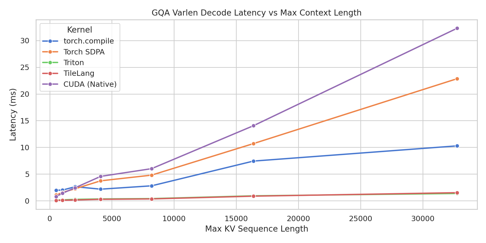
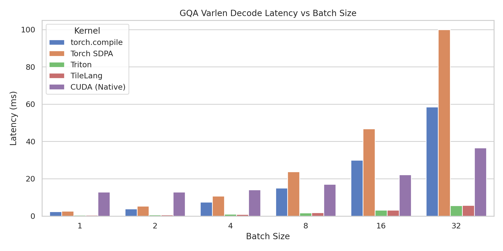

# FasterKernels ⚡ (v0.2.0)

A collection of open, highly-optimized attention and decoding kernels for AI inference implemented using **Triton**, **TileLang**, and **CUDA / C++**. 

Starting in **v0.2.0**, FasterKernels introduces first-class end-to-end inference engine integrations for Hugging Face models. The package now features optimized **FP8 e4m3 decoding pipelines** (tested with Qwen3-8B-FP8), custom **CUDA Graph capture runners** for zero-overhead autoregressive inference, and a dynamic **Paged Attention block allocator** (`PagedKVCache` + `paged_flash_decode`) to scale concurrent sequence throughput.

This repository targets next-generation LLM inference architectures, showcasing optimizations for **FlashAttention-2** (prefill) and **Flash Decoding** (GQA + varlen + attention sinks) on modern NVIDIA GPU architectures (e.g. NVIDIA L4 / Ada Lovelace). Direct support for **Huggingface 🤗** models using GQA with dynamic cache.

---

## Key Features

* **v0.2.0 Engine & FP8 Pipeline**: End-to-end inference stack supporting **FP8 (`e4m3fn`) execution paths** for quantized weights (such as Qwen3-8B-FP8) on modern datacenter GPUs (like NVIDIA L4).
* **CUDA Graph Autoregressive Capture**: An optimized `CUDAGraphRunner` that eliminates Python interpreter latency during decode steps by compiling and replaying static execution graphs.
* **Paged Attention KV Cache**: A fully functional `PagedKVCache` block manager (similar to vLLM's memory system) that allocates non-contiguous physical pages (size 16 tokens) mapped to logical sequences, paired with a custom Triton `paged_flash_decode` attention kernel.
* **FlashAttention-2 (Prefill)**: Implementation of the forward pass of the FlashAttention-2 algorithm supporting causal/non-causal attention.
* **Flash Decoding (GQA + Varlen)**: High-efficiency decoding kernels designed for Grouped Query Attention (GQA), variable sequence lengths per batch item (`varlen`), and long-context processing.
* **Attention Sinks Support**: First-class support for attention sinks (used to keep initial token activations for long-context generation) natively integrated into the online softmax computation.
* **Multi-Backend implementations**: Cross-compare identical algorithms written in Triton, TileLang (compiled to optimized CUDA via TVM-like DSL), and raw C++/CUDA templates.

---

## Kernel Registry

| Algorithm | Triton | TileLang | CUDA/C++ | Key Features |
|---|---|---|---|---|
| **FlashAttention-2** | [triton_fa2.py](fskernels/triton/triton_fa2.py) | [tilelang_fa2.py](fskernels/tilelang/tilelang_fa2.py) | [cuda_fa2.py](fskernels/cuda/cuda_fa2.py) | Causal/Non-causal, online softmax |
| **Flash Decoding** | [triton_gqa_decode.py](fskernels/triton/triton_gqa_decode.py) | [tilelang_gqa_decode.py](fskernels/tilelang/tilelang_gqa_decode.py) | [cuda_fd_gqa.py](fskernels/cuda/cuda_fd_gqa.py) | GQA (arbitrary group size), varlen layout, Attention Sinks (`s_aux`) |
| **FP8 Flash Decoding** | [triton_gqa_decode_hf_fp8.py](fskernels/triton/triton_gqa_decode_hf_fp8.py) | - | - | Optimized e4m3 FP8 decode attention for quantized LLMs |

---

## Performance Benchmarks

Below are benchmarking results evaluated on an **NVIDIA L4 GPU** (24GB VRAM, sm_89) under **FP16** precision. The benchmark sweeps Flash Decoding performance with Query Heads = 32, KV Heads = 8 (GQA Group Size = 4), Head Dim = 128.

### Latency Visualizations





### 1. Sequence Length Sweep (Fixed Batch Size = 4)
*Measures latency (ms) for varying context/sequence lengths.*

| Max Sequence Length | PyTorch Compile (ms) | PyTorch SDPA (ms) | Triton (ms) | TileLang (ms) | Native CUDA (ms) |
|---|---|---|---|---|---|
| **512** | 1.982 | 1.086 | 0.141 | **0.057** | 0.801 |
| **2048** | 2.636 | 2.258 | 0.268 | **0.152** | 2.441 |
| **8192** | 2.803 | 4.801 | 0.409 | **0.351** | 6.014 |
| **16384** | 7.433 | 10.706 | 0.931 | **0.865** | 14.052 |
| **32768** | 10.283 | 22.856 | **1.370** | 1.518 | 32.299 |

### 2. Batch Size Sweep (Fixed Max Sequence Length = 16384)
*Measures latency (ms) for varying batch sizes.*

| Batch Size | PyTorch Compile (ms) | PyTorch SDPA (ms) | Triton (ms) | TileLang (ms) | Native CUDA (ms) |
|---|---|---|---|---|---|
| **1** | 2.417 | 2.570 | **0.436** | 0.472 | 12.919 |
| **4** | 7.510 | 10.749 | 0.943 | **0.867** | 14.107 |
| **16** | 30.008 | 46.762 | 3.110 | **3.099** | 22.181 |
| **32** | 58.456 | 99.993 | **5.629** | 5.703 | 36.543 |

### 3. End-to-End FP8 Decoding Benchmarks (Qwen3-8B-FP8 on L4)
*System throughput and speedup measurements:*

| Strategy | Throughput (tok/s) | Latency (ms/tok) | Speedup |
|---|---|---|---|
| **Native HF Baseline** | 5.76 | 173.56 | 1.00x |
| **Triton Eager** | 5.86 | 170.55 | 1.02x |
| **CUDA Graph Decode** | 22.18 | 45.08 | 3.85x |
| **Paged Attention (Batch=4)** | 99.54 | 40.19 | 17.28x |

### Key Optimization Insights
* **Triton/TileLang vs. PyTorch SDPA**: Triton and TileLang are **15x - 18x faster** than PyTorch SDPA at larger batch sizes and context lengths.
* **Why is Native CUDA slower?**: The native CUDA implementation included is a template-free cooperative parallel reduction kernel. Unlike Triton and TileLang, it does not utilize specialized CUDA Tensor Cores or compiler-optimized double-buffered pipelines (`cp.async`).
* **Attention Sinks**: Standard PyTorch SDPA cannot support attention sinks (biasing softmax by keeping initial key/value activations) without falling back to un-fused computation. Triton, TileLang, and CUDA kernels support this natively using the `s_aux` parameter.
* **FP8 Dynamic Quantization**: Only the query (Q) tensor is dynamically quantized on-the-fly to FP8 (`e4m3fn`) during decoding. Keeping keys and values in standard precision avoids scanning the entire static KV cache for scales ((O_seqlen) scale estimation) at every generation step.
* **Precise GQA Head Masking**: When writing intermediate softmax scaling factors (`l_i`, `m_i`) to the global split-KV buffers, we utilize a precise 1D boundary mask `(offs_h < (start_q_head + GROUP_SIZE)) & (offs_h < NUM_Q_HEADS)`. This prevents concurrent thread blocks processing neighboring GQA groups from overwriting each other's memory.
* **CUDA Graph Position Replay**: To capture decoding loops inside a CUDA graph without Python interpreter overhead, we derived sequence cache indexes dynamically on the GPU using pure tensor operations from `cache_position`, avoiding all CPU-GPU synchronization blocks.

---

## Installation

Ensure you have Python 3.9+ and PyTorch installed with CUDA support.

```bash
# Clone the repository
git clone https://github.com/coder0143/fasterkernels.git
cd fasterkernels

# Editable installation of the package
pip install -e .

# Install with benchmarking dependencies (pandas, matplotlib, seaborn)
pip install -e ".[benchmarks]"

# Install with development/testing dependencies (pytest)
pip install -e ".[dev]"
```

---

## Usage Examples

### 1. Flash Decoding with GQA and Varlen (Triton)
```python
import torch
from fskernels.triton.triton_gqa_decode import flash_decode_gqa_varlen

# Batch setup: 4 requests, Q Head=32, KV Head=8, Head Dim=128
B, Q_H, KV_H, D = 4, 32, 8, 128

# Set up variable sequence lengths per batch element
k_seqlens = torch.tensor([512, 1024, 256, 2048], dtype=torch.int32, device="cuda")
cu_seqlens_k = torch.zeros(B + 1, dtype=torch.int32, device="cuda")
cu_seqlens_k[1:] = torch.cumsum(k_seqlens, dim=0)
total_kv_tokens = cu_seqlens_k[-1].item()

# Input tensors
q = torch.randn(B, Q_H, D, dtype=torch.float16, device="cuda")
k_varlen = torch.randn(total_kv_tokens, KV_H, D, dtype=torch.float16, device="cuda")
v_varlen = torch.randn(total_kv_tokens, KV_H, D, dtype=torch.float16, device="cuda")

# (Optional) Attention Sink Bias
sink = torch.randn(Q_H, dtype=torch.float32, device="cuda") * 0.1

# Invoke the kernel
output = flash_decode_gqa_varlen(q, k_varlen, v_varlen, cu_seqlens_k, s_aux=sink)
print("Output shape:", output.shape) # Expected: [4, 32, 128]
```

### 2. FlashAttention-2 Prefill (TileLang)
```python
import torch
from fskernels.tilelang.tilelang_fa2 import flash_attn_mha_bhsd

# Shape setup: [Batch, Heads, SeqLen, HeadDim]
q = torch.randn(4, 16, 4096, 128, dtype=torch.bfloat16, device="cuda")
k = torch.randn(4, 16, 4096, 128, dtype=torch.bfloat16, device="cuda")
v = torch.randn(4, 16, 4096, 128, dtype=torch.bfloat16, device="cuda")

# Invoke the JIT-compiled TileLang FlashAttention kernel
output = flash_attn_mha_bhsd(q, k, v, is_causal=False)
print("Output shape:", output.shape) # Expected: [4, 16, 4096, 128]
```

### 3. Use with HuggingFace transformers 🤗 (Support with hf dynamic cache)
```python
import torch
from transformers import AutoModelForCausalLM, AutoTokenizer, TextStreamer
import transformers.models.qwen3.modeling_qwen3 as qwen3_mod

# Kernel import
from fskernels.triton.triton_gqa_decode_hf import custom_hf_decode_attention_forward

# Intercept the execution registry globally
qwen3_mod.eager_attention_forward = custom_hf_decode_attention_forward

model_id = "Qwen/Qwen3-4B"
device = "cuda"
dtype = torch.float16

tokenizer = AutoTokenizer.from_pretrained(model_id)
tokenizer.clean_up_tokenization_spaces = False 

model = AutoModelForCausalLM.from_pretrained(
    model_id, 
    dtype=dtype, 
    device_map=device
)

prompt = "Explain the hardware roofline constraints of custom CUDA attention kernels:"
print(f"Prompt: {prompt}")
inputs = tokenizer(prompt, return_tensors="pt").to(device)

# Using text-streamer
streamer = TextStreamer(tokenizer, skip_prompt=True, skip_special_tokens=True)

print("\nAnswer: ")

with torch.no_grad():
    _ = model.generate(
        **inputs,
        max_new_tokens=400,
        do_sample=True,
        temperature=0.7,
        pad_token_id=tokenizer.eos_token_id,
        streamer=streamer,
        use_cache=True  # Dictates routing directly through your patched decode path
    )

print("Generated 400 tokens")
```

### 4. Fastest FP8 Inference (CUDA Graph & Paged Attention)

* Run with cuda graphs - 
```python
from transformers import AutoModelForCausalLM, AutoTokenizer

from fskernels.engine import FsInferenceEngine

model_card = "Qwen/Qwen3-8B-FP8"
device = "cuda"

print(f"Loading tokenizer & model {model_card} …")
tokenizer = AutoTokenizer.from_pretrained(model_card)
tokenizer.clean_up_tokenization_spaces = False

model = AutoModelForCausalLM.from_pretrained(
    model_card,
    device_map=device,
).eval()

print("Initializing FsInferenceEngine (CUDA Graph mode) …")
# Initialize engine (this will patch attention to use custom Triton kernel)
engine = FsInferenceEngine(model, tokenizer, device=device)

prompt = "Explain the hardware roofline constraints of custom CUDA attention kernels in detail:"
print(f"\nPrompt: {prompt}")

print("\nGenerating with CUDA Graph decode …")
# The first generate call will trigger CUDA graph capture (and JIT compile the kernels)
result = engine.generate(
    prompt,
    max_new_tokens=400,
    temperature=0.7,
    use_graph=True,
    warmup_steps=5,
)

print(f"\nAnswer:\n{result['text']}")
print(f"Tokens Generated : {result['new_tokens']}")
# Stats
print(f"Time Taken       : {result['elapsed_s']:.2f} seconds")
print(f"Throughput       : {result['tok_per_sec']:.2f} tokens/sec")
print(f"Latency per token: {result['ms_per_tok']:.2f} ms/token")
```

To execute inference using batched Paged Attention (dynamic block allocation) for high-throughput scaling:
```bash
python tests/run_hf_triton_fp8_paged.py
```

---

## Testing, Benchmarking & Profiling

### Running Unit Tests
Validate precision and correctness across all backends against PyTorch references:
```bash
# Run base tests
pytest tests/

# Verify FP8 GQA decode correctness against PyTorch reference
python tests/test_triton_gqa_decode_fp8.py
```

### Running Performance Benchmarks
Run sequence length and batch sweeps, generate latency plots, and output CSV metrics:
```bash
python benchmarks/benchmark.py --q-heads 32 --kv-heads 8 --head-dim 128 --dtype fp16
```
Plots and CSV results will be saved to `benchmarks/benchmark_plots/`.

To run the end-to-end decode engine benchmarking suite (Native HF, Triton Eager, CUDA Graph, Paged):
```bash
python benchmarks/benchmark_engine.py
```

### Profiling Triton Kernels
Compile lower representation code and generate performance summaries for Triton backends:
```bash
python profiling/profile_triton_fa2.py
python profiling/profile_triton_fd_gqa.py
```
Outputs are written under `profile/logs/`.
